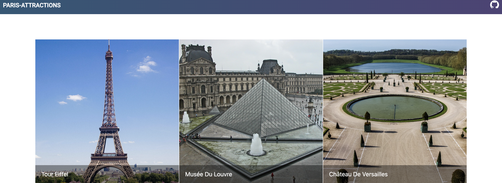
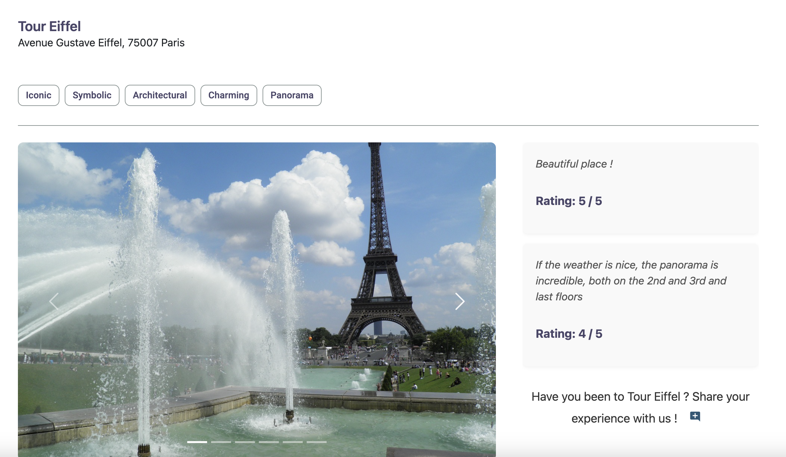

## PARIS-ATTRACTIONS: A Full Stack Web Application

Welcome to **paris-attractions**, a web application that allows users to discover the most attractive spots in Paris, France!

The application is built with a **frontend** in **Angular**, and a **backend** powered by **Spring Boot**, **Java**, and **MongoDB**.

## Deployment

The live version of the application is hosted on Render.

[paris-attractions](https://paris-attractions-website-8f5z.onrender.com/)

## Screenshots

Here’s a sneak peek of the app:

---

